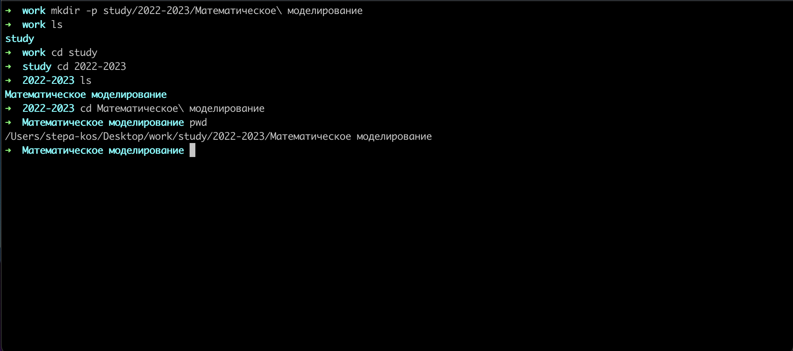
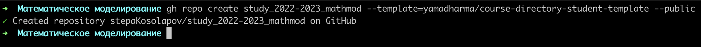
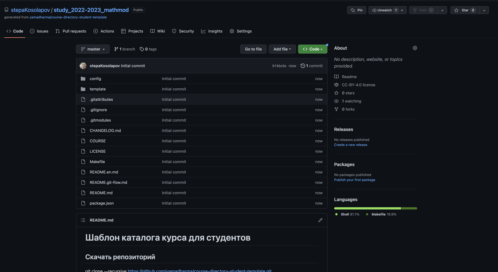
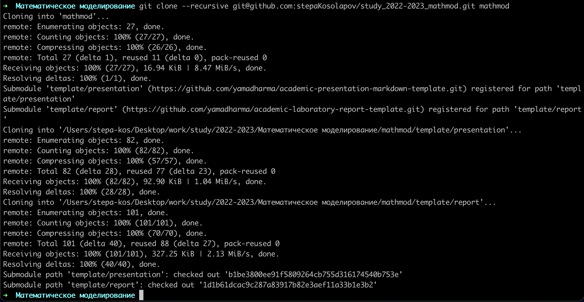
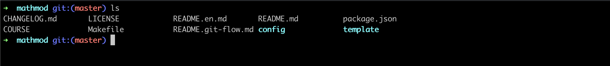
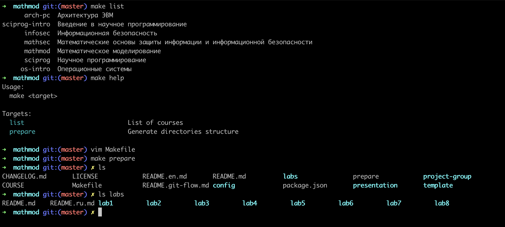
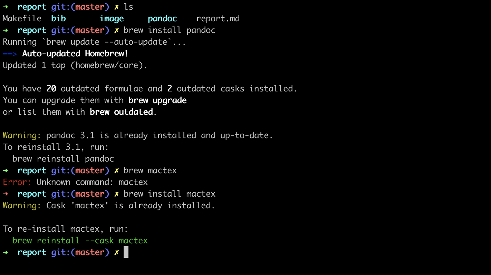
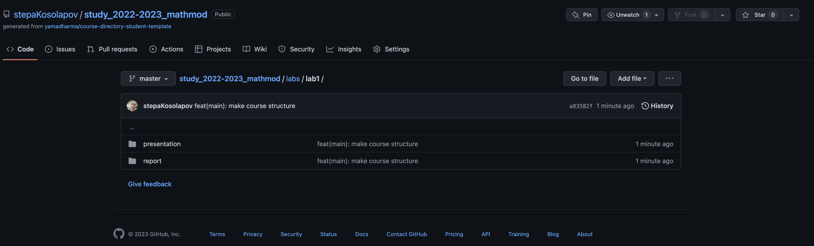
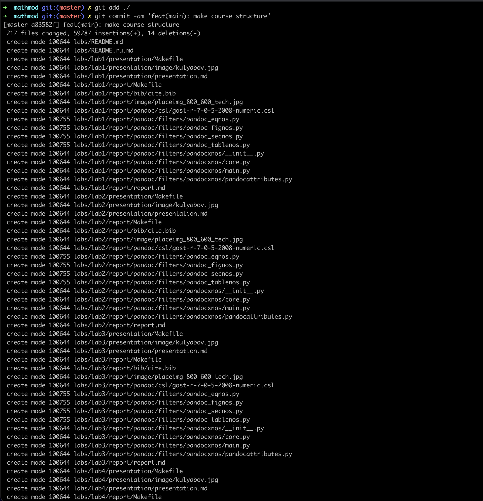

---
## Front matter
lang: ru-RU
title: Лабораторная работа 1
author:
  - Косолапов С. Э.
institute:
  - Российский университет дружбы народов, Москва, Россия

## i18n babel
babel-lang: russian
babel-otherlangs: english

## Formatting pdf
toc: false
toc-title: Содержание
slide_level: 2
aspectratio: 169
section-titles: true
theme: metropolis
header-includes:
 - \metroset{progressbar=frametitle,sectionpage=progressbar,numbering=fraction}
 - '\makeatletter'
 - '\beamer@ignorenonframefalse'
 - '\makeatother'
---

## Цель

Ознакомиться с git и Markdown. Сформировать рабочее окружение.

## Создали структуру каталогов

## Создали репозиторий на github

:::::::::::::: {.columns align=center}
::: {.column width="50%"}

:::
::: {.column width="50%"}

:::
::::::::::::::

## Склонировали себе репозиторий локально

:::::::::::::: {.columns align=center}
::: {.column width="50%"}

:::
::: {.column width="50%"}

:::
::::::::::::::

## Создали структуру каталогов через make

## Установили pandoc и mactex(texlive для OSX)

## Запушили изменения в github

:::::::::::::: {.columns align=center}
::: {.column width="50%"}

:::
::: {.column width="50%"}

:::
::::::::::::::

## Вывод

В ходе данной лабораторной работы мы вспомнили как работать с git и markdown, создали рабочее пространство
