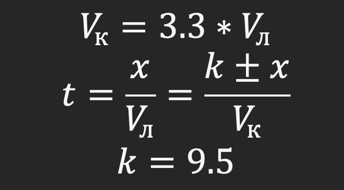
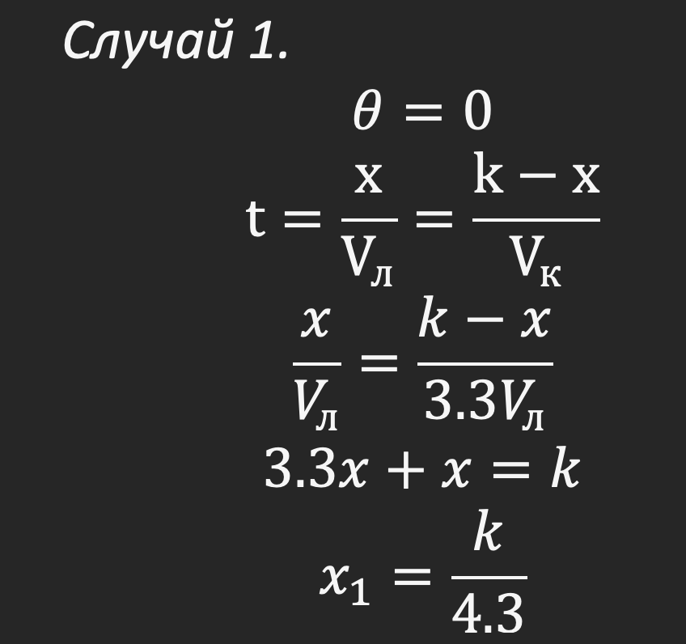
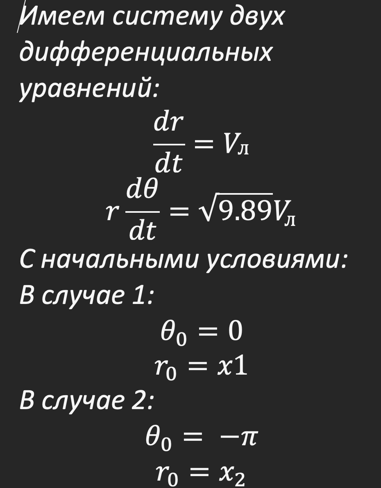
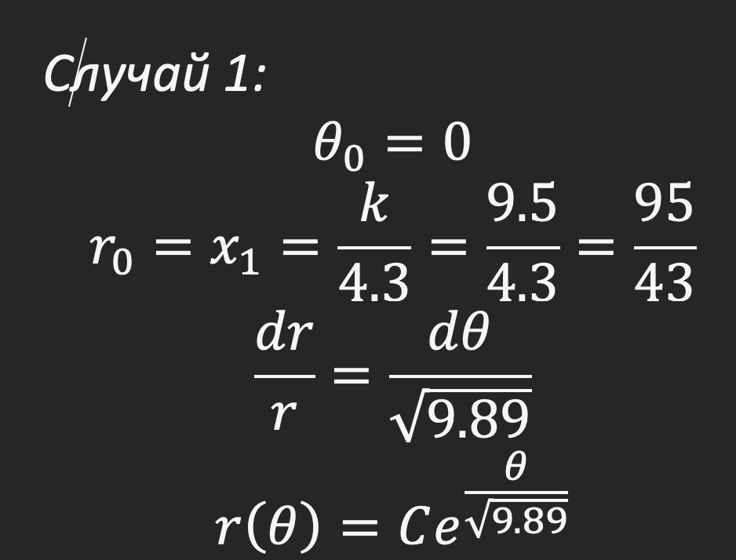
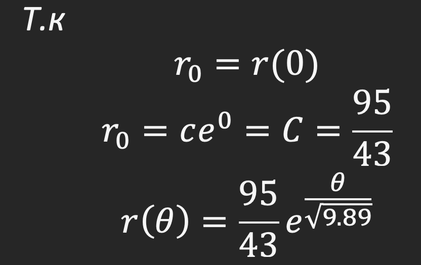
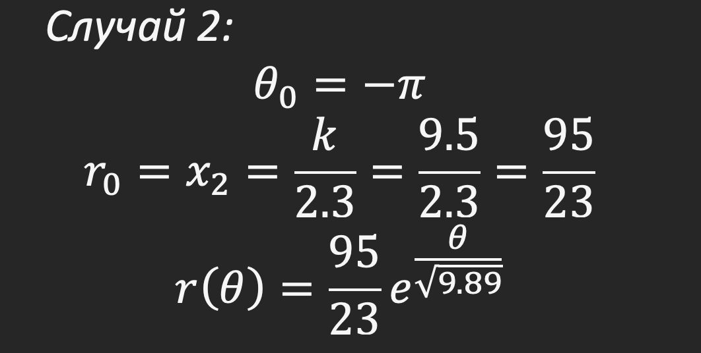
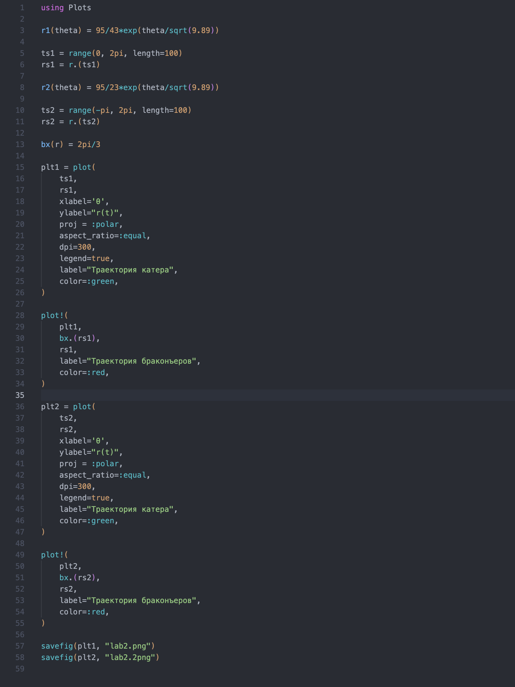
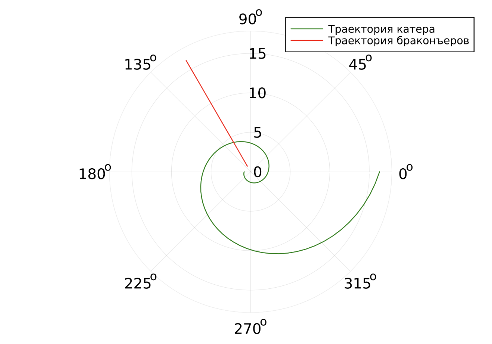

---
## Front matter
lang: ru-RU
title: Лабораторная работа 1
author:
  - Косолапов С. Э.
institute:
  - Российский университет дружбы народов, Москва, Россия

## i18n babel
babel-lang: russian
babel-otherlangs: english

## Formatting pdf
toc: false
toc-title: Содержание
slide_level: 2
aspectratio: 169
section-titles: true
theme: metropolis
header-includes:
 - \metroset{progressbar=frametitle,sectionpage=progressbar,numbering=fraction}
 - '\makeatletter'
 - '\beamer@ignorenonframefalse'
 - '\makeatother'
---

## Цель

Решить задачу о погоне

## Постановка задачи

Вариант 16
На море в тумане катер береговой охраны преследует лодку браконьеров.
Через определенный промежуток времени туман рассеивается, и лодка
обнаруживается на расстоянии 9,5 км от катера. Затем лодка снова скрывается в
тумане и уходит прямолинейно в неизвестном направлении. Известно, что скорость
катера в 3,3 раза больше скорости браконьерской лодки.
  1. Запишите уравнение, описывающее движение катера, с начальными
  условиями для двух случаев (в зависимости от расположения катера
  относительно лодки в начальный момент времени).
  2. Постройте траекторию движения катера и лодки для двух случаев.

## Начальные данные

## Случай 1

## Случай 2

## Вывод дифференциальных уравненийй

## Нахождение уравнение спирали для случая 1

:::::::::::::: {.columns align=center}
::: {.column width="50%"}

:::
::: {.column width="50%"}

:::
::::::::::::::

## Нахождение уравнение спирали для случая 2

## Написание кода

{height="60%"}

## График для случая 1

## График для случая 2

## Вывод

В данной лабораторной работе мы решили задачу о погоне и построили график с помощью Julia.
