---
## Front matter
title: "Отчёт по лабораторной работе 2"
author: "Косолапов Степан Эдуардович"

## Generic otions
lang: ru-RU
toc-title: "Содержание"

## Bibliography
bibliography: bib/cite.bib
csl: pandoc/csl/gost-r-7-0-5-2008-numeric.csl

## Pdf output format
toc: true # Table of contents
toc-depth: 2
lof: true # List of figures
lot: true # List of tables
fontsize: 12pt
linestretch: 1.5
papersize: a4
documentclass: scrreprt
## I18n polyglossia
polyglossia-lang:
  name: russian
  options:
	- spelling=modern
	- babelshorthands=true
polyglossia-otherlangs:
  name: english
## I18n babel
babel-lang: russian
babel-otherlangs: english
## Fonts
mainfont: PT Serif
romanfont: PT Serif
sansfont: PT Sans
monofont: PT Mono
mainfontoptions: Ligatures=TeX
romanfontoptions: Ligatures=TeX
sansfontoptions: Ligatures=TeX,Scale=MatchLowercase
monofontoptions: Scale=MatchLowercase,Scale=0.9
## Biblatex
biblatex: true
biblio-style: "gost-numeric"
biblatexoptions:
  - parentracker=true
  - backend=biber
  - hyperref=auto
  - language=auto
  - autolang=other*
  - citestyle=gost-numeric
## Pandoc-crossref LaTeX customization
figureTitle: "Рис."
tableTitle: "Таблица"
listingTitle: "Листинг"
lofTitle: "Список иллюстраций"
lotTitle: "Список таблиц"
lolTitle: "Листинги"
## Misc options
indent: true
header-includes:
  - \usepackage{indentfirst}
  - \usepackage{float} # keep figures where there are in the text
  - \floatplacement{figure}{H} # keep figures where there are in the text
---

# Цель работы

Решить "Задачу о погоне"

# Задание

Вариант 16
На море в тумане катер береговой охраны преследует лодку браконьеров.
Через определенный промежуток времени туман рассеивается, и лодка
обнаруживается на расстоянии 9,5 км от катера. Затем лодка снова скрывается в
тумане и уходит прямолинейно в неизвестном направлении. Известно, что скорость
катера в 3,3 раза больше скорости браконьерской лодки.
  1. Запишите уравнение, описывающее движение катера, с начальными
  условиями для двух случаев (в зависимости от расположения катера
  относительно лодки в начальный момент времени).
  2. Постройте траекторию движения катера и лодки для двух случаев.

# Теоретическое введение

Про язык Julia - изучили материалы см. в [@julialang].

Прочитали методические материалы см. в [@materials].

# Выполнение лабораторной работы

Изначально нам дано, что скорость катера в 3.3 раза больше чем скорость лодки. Кроме того, нам известно расстояние от лодки до катера - 9.5 км. Исходя из этого - посчитаем чему равно время (@fig:000). 

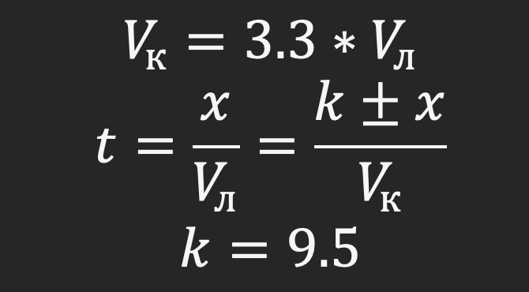{#fig:000 width=70%}

Далее, исходя из формулы времени считаем x. Всего есть два случая - когда theta = 0 и когда theta = -π. 
Рассмотрев первый случай получаем x₁ (@fig:001). 

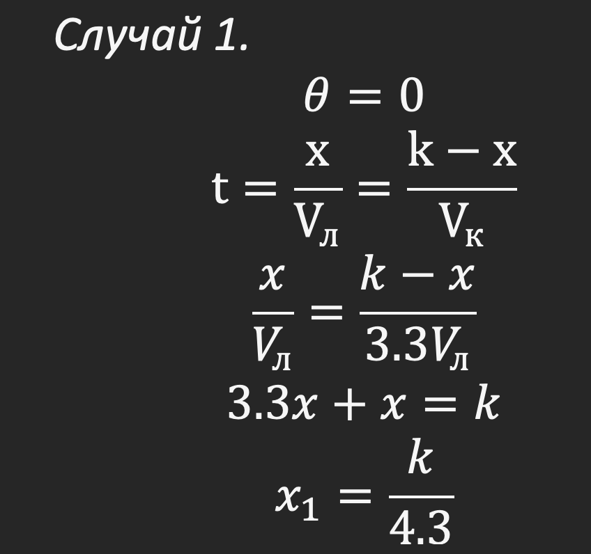{#fig:001 width=70%}

Рассматриваем случай 2, когда theta = -π(@fig:002).

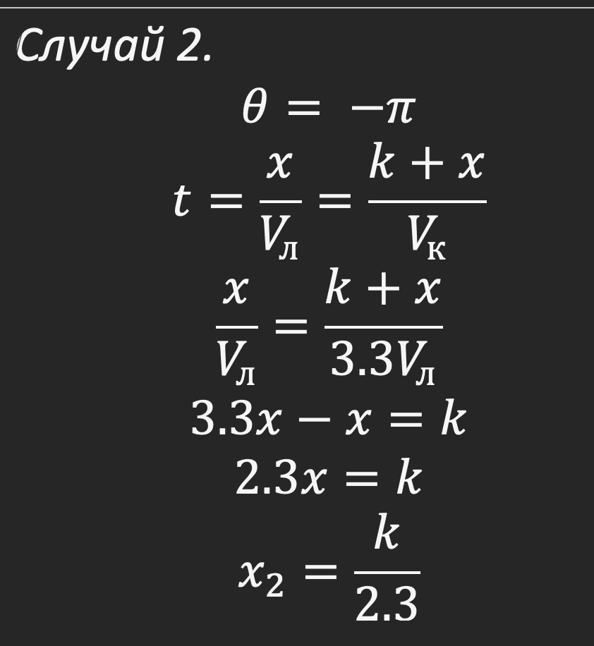{#fig:002 width=70%}

Мы знаем, что скрость катера можно разложить на скорость тангенциальную и скорость радиальную. Выразив тангенциальную скорость и зная, что нам нужно, чтобы радиальная скорость была равна скорости лодки, подставляем в выражение и получаем тангенциальную скорость(@fig:003). 

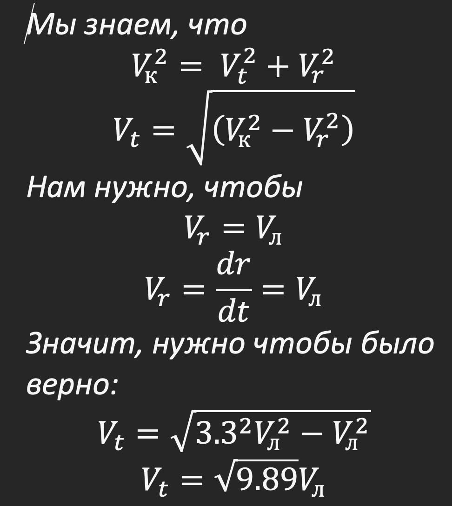{#fig:003 width=70%}

Кроме этого, мы знаем, что тангенциальная скорость это отношение длины дуги сектора к dt. Получаем уравнение(@fig:004). 

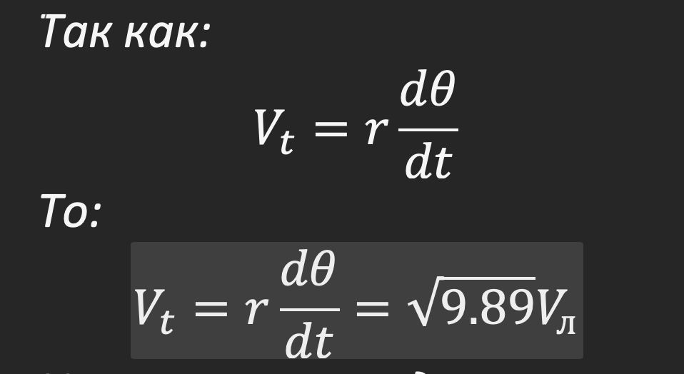{#fig:004 width=70%}

Теперь у нас есть система двух дифференциальных уравнений(@fig:005). 

{#fig:005 width=70%}

Исключим производную по t(@fig:006). 

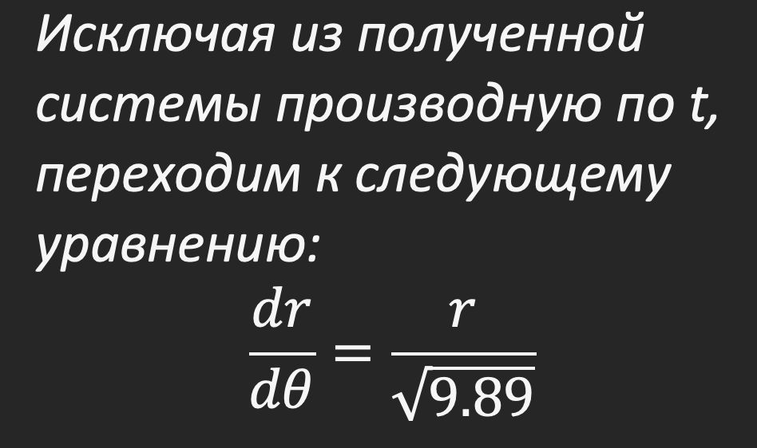{#fig:006 width=70%}

Теперь, для каждого из случаев подставим в решенное дифференциальное уравнение начальные значения, чтобы выразить константу C (см. в [@materials]). Разберем случай 1 (@fig:007). 

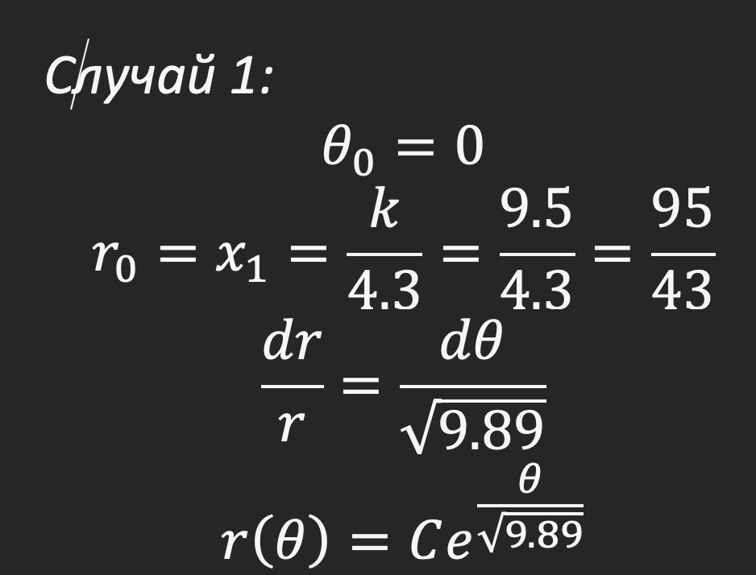{#fig:007 width=70%}

Находим константу C и подставляем, получив уравнение кривой движения катера(@fig:008). 

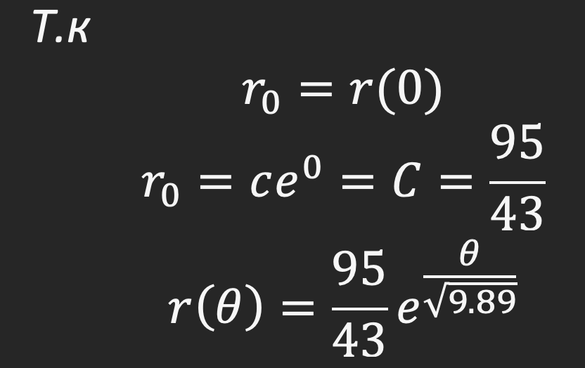{#fig:008 width=70%}

То же самое делаем в случае 2(@fig:009). 

{#fig:009 width=70%}

Теперь мы можем приступить к графику. Чтобы нарисовать график - будем использовать пакет Plots в языке Julia см. в [@julialang]. Напишем код для двух случаев(@fig:010)

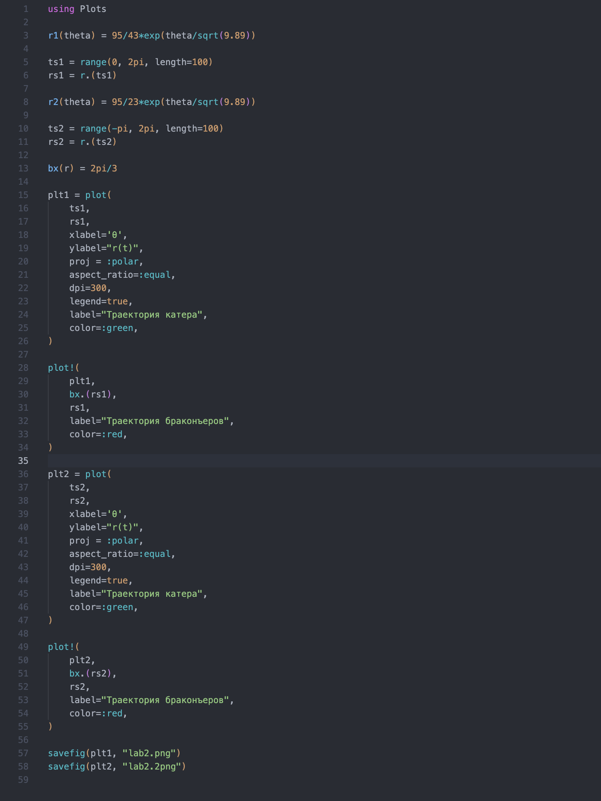{#fig:010 width=70%}

Получаем траекторию катера в случае 1(@fig:011)

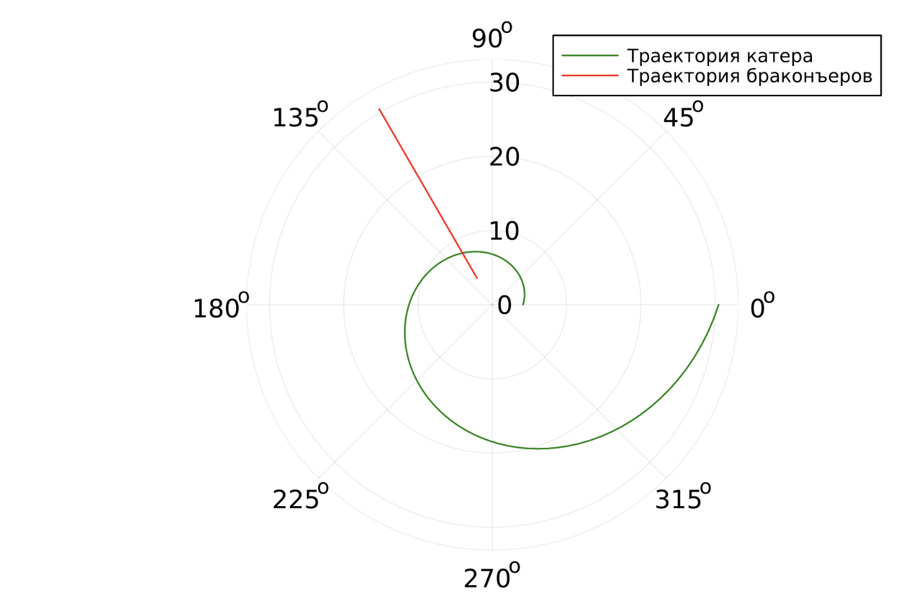{#fig:011 width=70%}

И траекторию катера в случае 2(@fig:012)

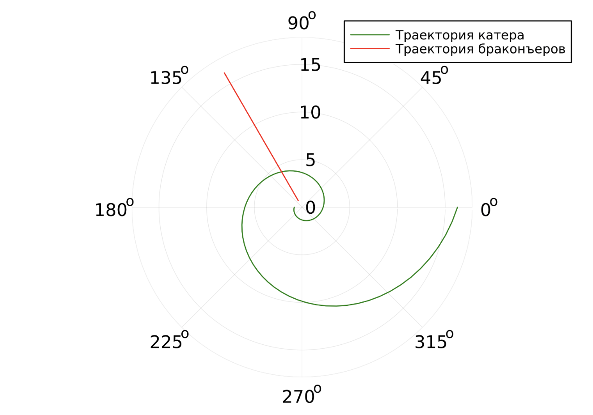{#fig:012 width=70%}

# Выводы

В данной лабораторной работе мы решили задачу о погоне и построили график с помощью Julia.

# Список литературы{.unnumbered}

::: {#refs}
:::
