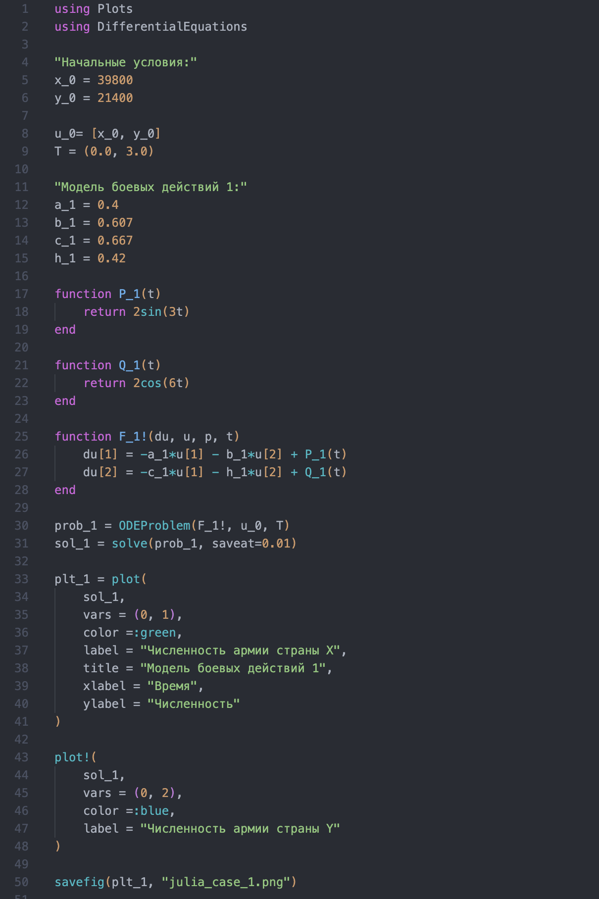
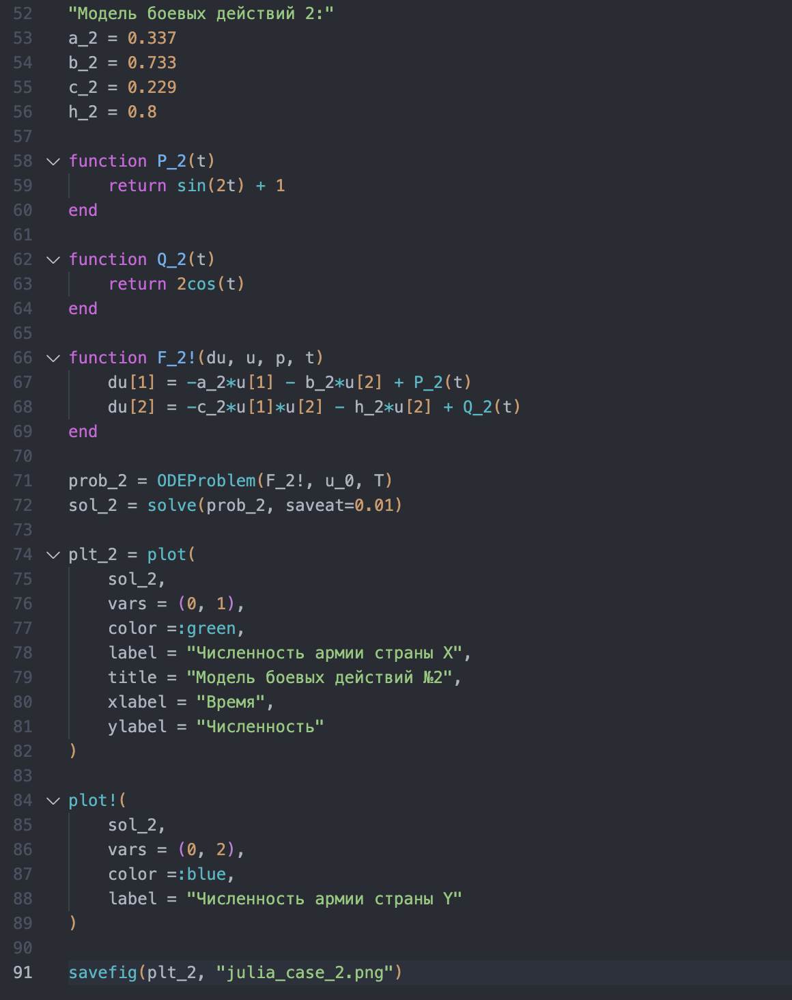
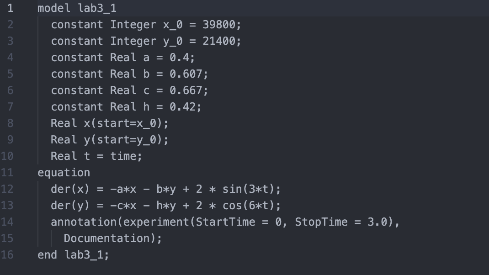
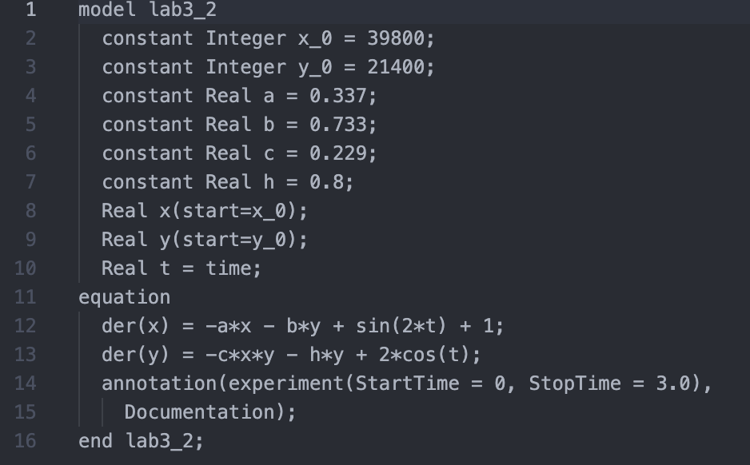
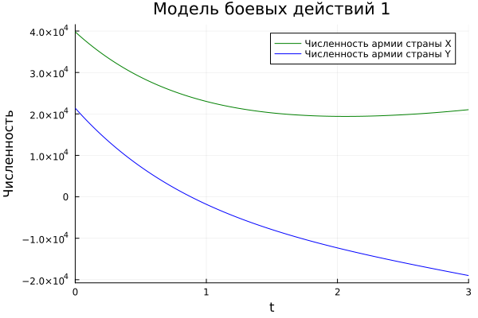
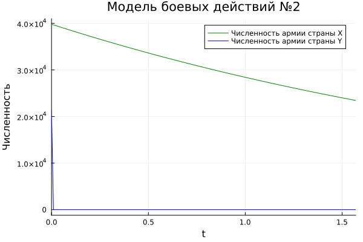
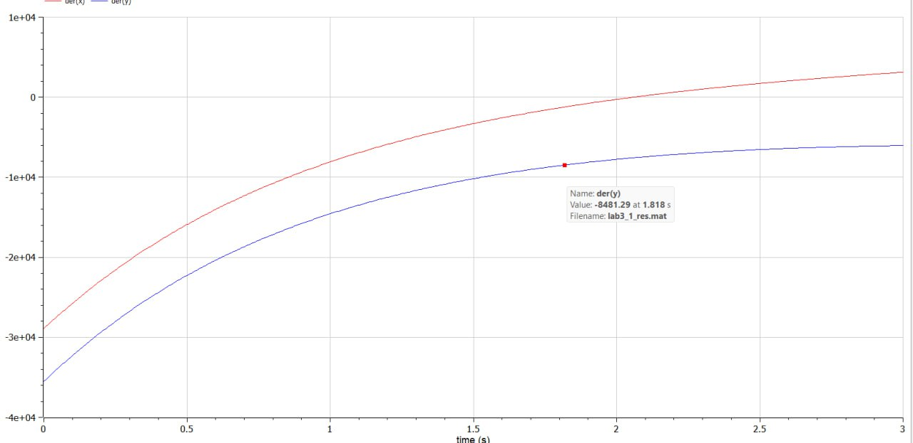
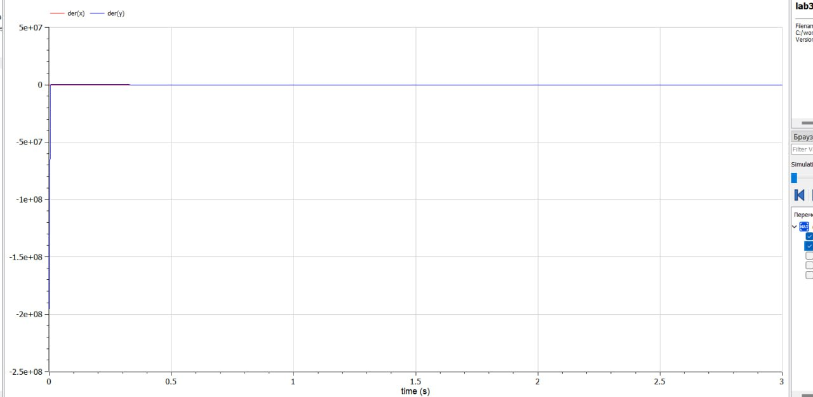

---
## Front matter
lang: ru-RU
title: Лабораторная работа №3
author:
  - Косолапов Степан Эдуардович.
institute:
  - Российский университет дружбы народов, Москва, Россия

## i18n babel
babel-lang: russian
babel-otherlangs: english

## Formatting pdf
toc: false
toc-title: Содержание
slide_level: 2
aspectratio: 169
section-titles: true
theme: metropolis
header-includes:
 - \metroset{progressbar=frametitle,sectionpage=progressbar,numbering=fraction}
 - '\makeatletter'
 - '\beamer@ignorenonframefalse'
 - '\makeatother'
---

# Информация

## Докладчик

  * Косолапов Степан Эдуардович
  * студент группы НПИбд-01-20
  * Российский университет дружбы народов
  * <https://github.com/stepaKosolapov>

# Вводная часть

## Актуальность

- Необходимость навыков моделирования реальных математических задач, построение графиков. 

## Объект и предмет исследования

- Задача о ведении боевых действий
- Языки для моделирования:
  - Julia
  - OpenModelica

## Цели и задачи

- Рассмотреть два случая ведения боевых действий:
  1. Модель боевых действий между регулярными войсками;
  2. Модель ведение боевых действий с участием регулярных войск и партизанских отрядов;
- Построить графики изменения численности войск армии Х и армии У для соответствующий случаев.

## Материалы и методы

- Языки для моделирования:
  - Julia
  - OpenModelica

# Процесс выполнения работы

## Условие модели №1

- Модель боевых действий между регулярными войсками:

    $$
    \begin{cases}
      \frac{dx}{dt}=-0.4x(t)-0.607y(t)+2\sin(3t)
      \\
      \frac{dy}{dt}=-0.667x(t)-0.42y(t)+2\cos(6t)
    \end{cases}
  $$

## Теория модели №1

$$
  \begin{cases}
    \frac{dx}{dt}=-a(t)x(t)-b(t)y(t)+P(t)
    \\
    \frac{dy}{dt}=-c(t)x(t)-h(t)y(t)+Q(t)
  \end{cases}
$$
$$
\begin{cases}
    \dot{x}=-by
    \\
    \dot{y}=-cx
  \end{cases}
$$
$$
\begin{aligned}
  \frac{dx}{dy}=\frac{by}{cx}\\ 
  cxdx=bydy\\ 
  cx^2-by^2=C
\end{aligned}
$$

## Условие модели №2

$$
    \begin{cases}
      \frac{dx}{dt}=-0.337x(t)-0.733y(t)+\sin(2t)+1
      \\
      \frac{dy}{dt}=-0.29x(t)y(t)-0.8y(t)+2\cos(t)
    \end{cases}
  $$

## Теория модели №2

$$
  \begin{cases}
    \frac{dx}{dt}=-a(t)x(t)-b(t)y(t)+P(t)
    \\
    \frac{dy}{dt}=-c(t)x(t)y(t)-h(t)y(t)+Q(t)
  \end{cases}
$$
$$
  \begin{cases}
    \frac{dx}{dt}=-by(t)
    \\
    \frac{dy}{dt}=-cx(t)y(t)
  \end{cases}
$$
$$
\frac{d}{dt}\left(\frac{b}{2}x^{2}(t)-cy(t)\right)=0
$$
$$
\frac{b}{2}x^{2}(t)-cy(t)=\frac{b}{2}x^{2}(0)-cy(0)=C_{1}
$$

## Код на Julia

:::::::::::::: {.columns align=center}
::: {.column width="50%"}

:::
::: {.column width="50%"}

:::
::::::::::::::

## Код на OpenModelica

:::::::::::::: {.columns align=center}
::: {.column width="50%"}

:::
::: {.column width="50%"}

:::
::::::::::::::

## Графики Julia

:::::::::::::: {.columns align=center}
::: {.column width="50%"}

:::
::: {.column width="50%"}

:::
::::::::::::::

## Графики на openmodelica

:::::::::::::: {.columns align=center}
::: {.column width="50%"}

:::
::: {.column width="50%"}

:::
::::::::::::::

# Результаты работы

- Рассмотрели два случая ведения боевых действий:
  1. Модель боевых действий между регулярными войсками;
  2. Модель ведение боевых действий с участием регулярных войск и партизанских отрядов;
- Построили графики изменения численности войск армии Х и армии У для соответствующий случаев.

# Вывод

Создали модель боевых действий по средствам языков Julia и OpenModelica. Построили соответствующие графики двух случаев ведения боевых действий.

[def]: ttps://github.com/stepaKosolapov