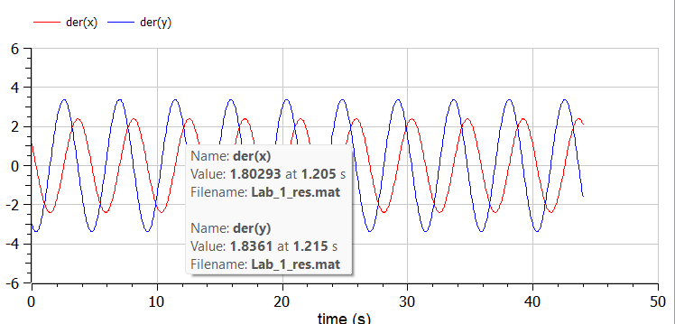
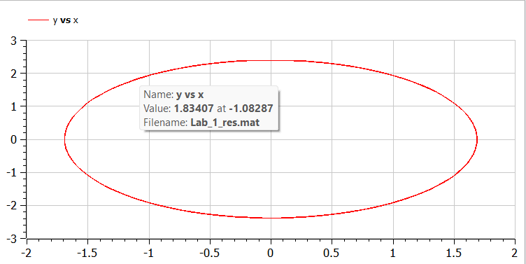
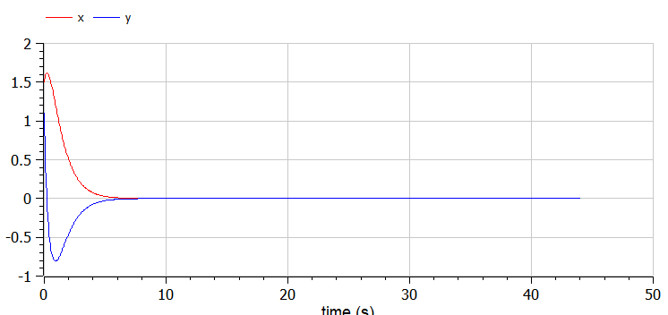
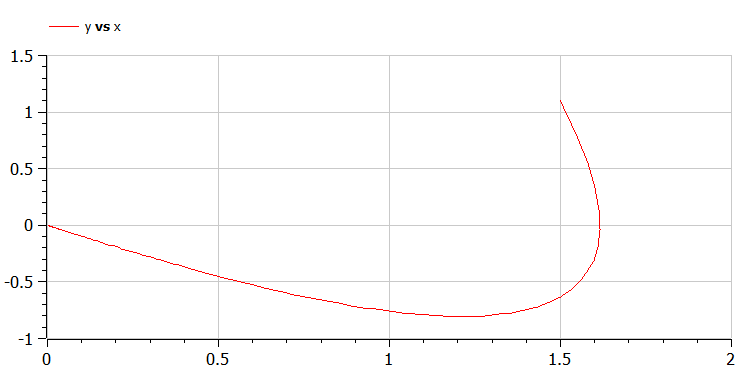
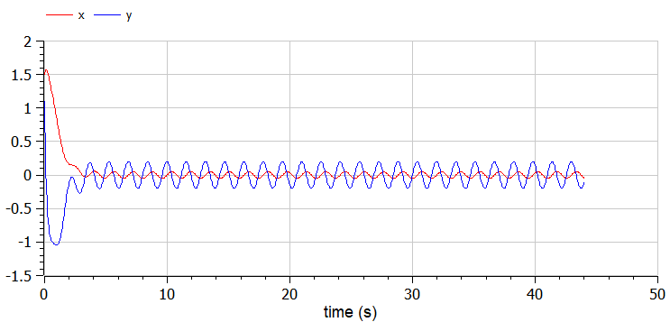
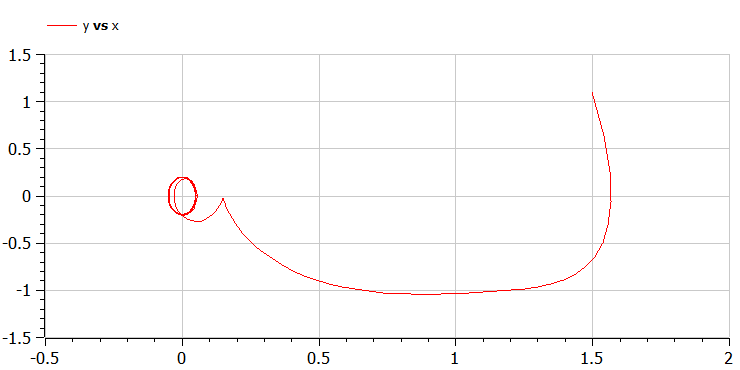

---
## Front matter
lang: ru-RU
title: Лабораторная работа №4
author:
  - Косолапов Степан Эдуардович.
institute:
  - Российский университет дружбы народов, Москва, Россия

## i18n babel
babel-lang: russian
babel-otherlangs: english

## Formatting pdf
toc: false
toc-title: Содержание
slide_level: 2
aspectratio: 169
section-titles: true
theme: metropolis
header-includes:
 - \metroset{progressbar=frametitle,sectionpage=progressbar,numbering=fraction}
 - '\makeatletter'
 - '\beamer@ignorenonframefalse'
 - '\makeatother'
---

# Информация

## Докладчик

  * Косолапов Степан Эдуардович
  * студент группы НПИбд-01-20
  * Российский университет дружбы народов
  * <https://github.com/stepaKosolapov>

# Вводная часть

## Актуальность

- Необходимость навыков моделирования реальных математических задач, построение графиков. 

## Объект и предмет исследования

- Задача о гармонических колебаний
- Языки для моделирования:
  - Julia
  - OpenModelica

## Цели и задачи

Постройте фазовый портрет гармонического осциллятора и решение уравнения гармонического осциллятора для следующих случаев 

1. Колебания гармонического осциллятора без затуханий и без действий внешней
силы $\ddot{x}+2x=0$
2. Колебания гармонического осциллятора c затуханием и без действий внешней
силы $\ddot{x}+3\dot{x}+3x=0$
3. Колебания гармонического осциллятора c затуханием и под действием внешней
силы $\ddot{x}+4\dot{x}+4x\cos{4t}$

На итнтервале $t \in [ 0;44 ]$, шаг 0.05, $x_0=1.5, y_0=1.1$

## Материалы и методы

- Языки для моделирования:
  - Julia
  - OpenModelica

# Процесс выполнения работы

## Колебания без затухания

В системе отсутствуют потери энергии (колебания без затухания)
Получаем уравнение 
$$\ddot{x}+\omega_0^2x=0$$

Переходим к двум дифференциальным уравнениям первого порядка:
$$
 \begin{cases}
	\dot{x}=y
	\\   
	\dot{y}=-\omega_0^2x
 \end{cases}
$$

## Графики

:::::::::::::: {.columns align=center}
::: {.column width="50%"}

:::
::: {.column width="50%"}

:::
::::::::::::::

## Колебания с затуханием

В системе присутствуют потери энергии (колебания с затуханием)
Получаем уравнение 
$$\ddot{x}+2\gamma\dot{x}+\omega_0^2x=0$$

Переходим к двум дифференциальным уравнениям первого порядка:
$$
 \begin{cases}
	\dot{x}=y
	\\   
	\dot{y}=-2\gamma y-\omega_0^2x
 \end{cases}
$$

## Графики

:::::::::::::: {.columns align=center}
::: {.column width="50%"}

:::
::: {.column width="50%"}

:::
::::::::::::::

## Графики

На систему действует внешняя сила.
Получаем уравнение 
$$\ddot{x}+2\gamma\dot{x}+\omega_0^2x=F(t)$$

Переходим к двум дифференциальным уравнениям первого порядка:
$$
 \begin{cases}
	\dot{x}=y
	\\   
	\dot{y}=F(t)-2\gamma y-\omega_0^2x
 \end{cases}
$$

## Графики

:::::::::::::: {.columns align=center}
::: {.column width="50%"}

:::
::: {.column width="50%"}

:::
::::::::::::::

# Результаты работы

- Рассмотрели три случая колебания.
- Построили графики для соответствующий случаев.

# Вывод

Я рассмотрел и построил фазовые портреты гармонических колебаний без затухания, с затуханием и при действии внешней силы.

[def]: ttps://github.com/stepaKosolapov