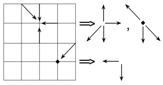
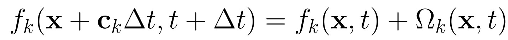

---
## Front matter
lang: ru-RU
title: Решеточные газы, решеточное уравнение Больцмана
subtitle: Модель задачи
author:
  - Афтаева К. В
  - Бакулин Н. А
  - Боровикова К. В
  - Гаглоев О. М
  - Губина О. В
  - Косолапов С. Э
institute:
  - Российский университет дружбы народов, Москва, Россия

## i18n babel
babel-lang: russian
babel-otherlangs: english

## Formatting pdf
toc: false
toc-title: Содержание
slide_level: 2
aspectratio: 169
section-titles: true
theme: metropolis
header-includes:
 - \metroset{progressbar=frametitle,sectionpage=progressbar,numbering=fraction}
 - '\makeatletter'
 - '\beamer@ignorenonframefalse'
 - '\makeatother'
---

# Вводная часть

## Актуальность

- Новый метод - первые продукты на его основе появились около 2010 года
- Метод основан на целочисленной арифметике
- Преимущество над другими методами в распараллеливании
- Моделирование многофазных потоков и потоков в пористых средах
- Возможное применение в множестве сфер промышленности

## Объект и предмет исследования

- Метод решеточных газов для моделирования процессов гидродинамики
- Решеточное уравнение Больцмана
- Модели решеточных газов и их правила

## Цели и задачи

- Теоретическое описание задачи
- Представить описание модели

## Материалы и методы

- Основа модели - клеточный автомат
- Модель использует решеточное уравнение Больцмана

# Описание задачи и модели

## Задача 

- Смоделировать процесс взаимодействия молекул газа в замкнутом пространстве

## Решеточные газы (Lattice-Gas Automata, LGA)

- Является клеточным автоматом
- Пространство делится на клетки
- Эволюция каждой клетки зависит от состояния соседних клеток
- Каждая частица имеет скорость и массу
- Два этапа клеточного автомата - распространение и столкновение

## Модель HPP (Hardy–Pomeau–Pazzis)

:::::::::::::: {.columns align=center}
::: {.column width="70%"}

  * Квадратная сетка
  * 9 направлений движения частиц
  * Частицы могут стоять на месте
  * Масса частиц - 1 условная единица
  * Скорость движущихся частиц равна 1 у.е или $\sqrt{2}$у.е

:::
::: {.column width="30%"}

:::
::::::::::::::

## Решеточное уравнение Больцмана

:::::::::::::: {.columns align=center}
::: {.column width="70%"}

  * Позволяет избавиться от статистического шума метода LGA
  * Дает возможность получить физические величины в процессе моделирования

:::
::: {.column width="30%"}

:::
::::::::::::::

## Результат первого этапа работы

- Сформулирована решаемая задача
- Выбран метод моделирования и модель
